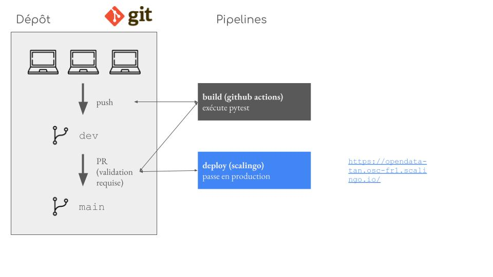
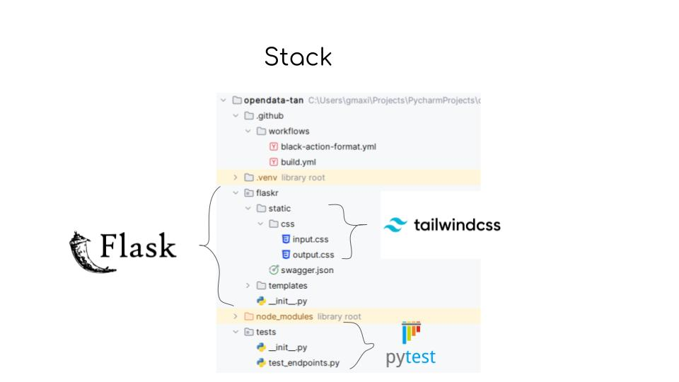

# opendata-tan
Le projet utilise les données mises à disposition par la tan [ici](https://open.tan.fr/doc/openapi).

# Endpoints
La documentation des différents endpoints peut être trouvée [ici](https://opendata-tan.osc-fr1.scalingo.io/api/docs/).
# Architecture

# Pipelines

# Stack

# Comment contribuer ? 
La branche main est protégée. Tous les développements se font sur la branche dev. Il faut ensuite faire une demande de pull request sur Github. Celle-ci doit être approuvée par une personne de l'équipe et le code doit passer la pipeline de tests pour pouvoir être mergé dans la branche main. Ensuite, l'application est déployée sur Scalingo automatiquement. 
=======

# Documentation 
La documentation est disponible [ici](http://opendata-tan.osc-fr1.scalingo.io/api/docs/) 