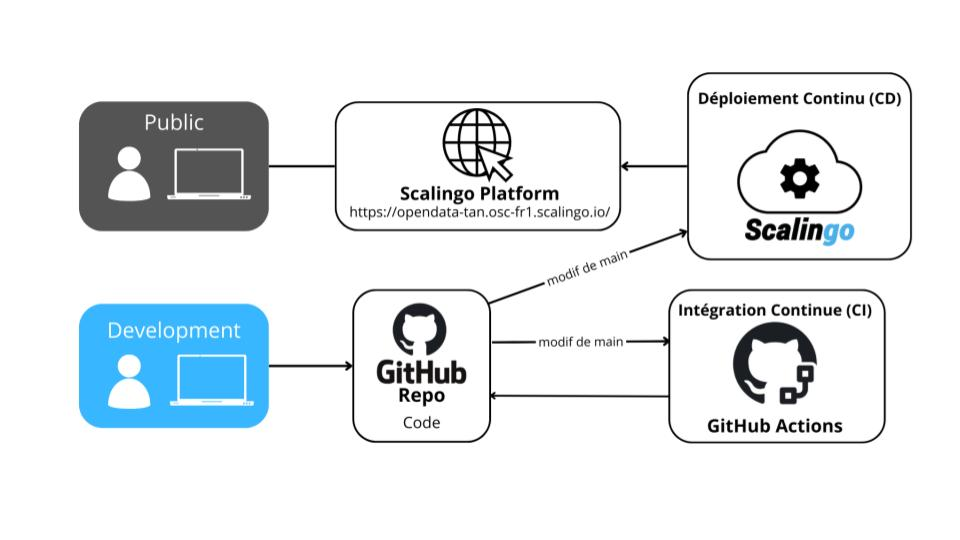

# opendata-tan
Le projet utilise les données mises à disposition par la tan [ici](https://open.tan.fr/doc/openapi).
# Endpoints
La documentation des différents endpoints peut être trouvée [ici](https://opendata-tan.osc-fr1.scalingo.io/api/docs/).
# architecture

# pipelines

# stack
